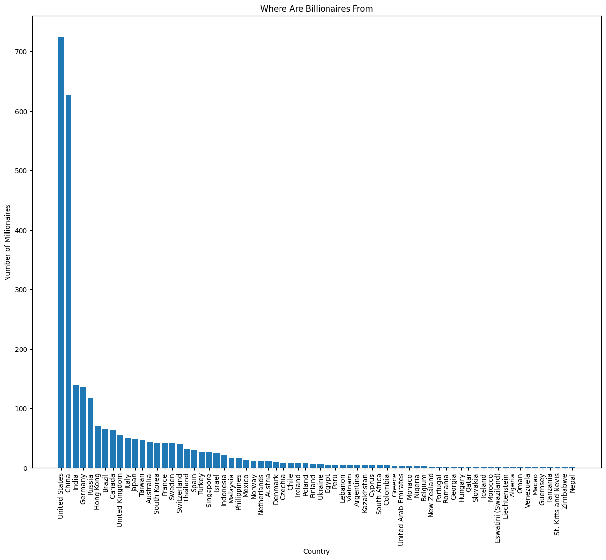

# **Descriptive Analysis Of All The World's Billionaires From 2021**
*(Data Source: Forbes)*

**1. Import the packages necessary for the following analysis.**


```python
import pandas as pd  # imports pandas and calls the imported version 'pd'
import matplotlib.pyplot as plt  # imports the package and calls it 'plt'
import seaborn as sns  # imports the seaborn package with the imported name 'sns'
```

**2. Read the file into a pandas data frame and display the first several lines of the data frame.**


```python
df = pd.read_csv("Billionaire_2021.csv")
df.head()
```


<div>
<style scoped>
    .dataframe tbody tr th:only-of-type {
        vertical-align: middle;
    }

    .dataframe tbody tr th {
        vertical-align: top;
    }

    .dataframe thead th {
        text-align: right;
    }
</style>
<table border="1" class="dataframe">
  <thead>
    <tr style="text-align: right;">
      <th></th>
      <th>Name</th>
      <th>NetWorth</th>
      <th>Country</th>
      <th>Source</th>
      <th>Rank</th>
      <th>Age</th>
      <th>Industry</th>
    </tr>
  </thead>
  <tbody>
    <tr>
      <th>0</th>
      <td>Jeff Bezos</td>
      <td>$177 B</td>
      <td>United States</td>
      <td>Amazon</td>
      <td>1</td>
      <td>57.0</td>
      <td>Technology</td>
    </tr>
    <tr>
      <th>1</th>
      <td>Elon Musk</td>
      <td>$151 B</td>
      <td>United States</td>
      <td>Tesla, SpaceX</td>
      <td>2</td>
      <td>49.0</td>
      <td>Automotive</td>
    </tr>
    <tr>
      <th>2</th>
      <td>Bernard Arnault &amp; family</td>
      <td>$150 B</td>
      <td>France</td>
      <td>LVMH</td>
      <td>3</td>
      <td>72.0</td>
      <td>Fashion &amp; Retail</td>
    </tr>
    <tr>
      <th>3</th>
      <td>Bill Gates</td>
      <td>$124 B</td>
      <td>United States</td>
      <td>Microsoft</td>
      <td>4</td>
      <td>65.0</td>
      <td>Technology</td>
    </tr>
    <tr>
      <th>4</th>
      <td>Mark Zuckerberg</td>
      <td>$97 B</td>
      <td>United States</td>
      <td>Facebook</td>
      <td>5</td>
      <td>36.0</td>
      <td>Technology</td>
    </tr>
  </tbody>
</table>
</div>


**3. Determine how many rows (observations) and columns there are.**


```python
df.shape
```


    (2755, 7)


**4. Determine how many billionaires there are from each country in this dataset.**


```python
country_count = df.Country.value_counts()
country_count
```


    Country
    United States          724
    China                  626
    India                  140
    Germany                136
    Russia                 118
                          ... 
    Guernsey                 1
    Tanzania                 1
    St. Kitts and Nevis      1
    Zimbabwe                 1
    Nepal                    1
    Name: count, Length: 70, dtype: int64


**5. Get the descriptive statistics.**


```python
print(f'Mean is {country_count.mean()}')
print(f'Median is {country_count.median()}')
print(f'Standard deviation is {country_count.std()}')
```

    Mean is 39.357142857142854
    Median is 7.0
    Standard deviation is 114.12084057080895


**6. Make a barplot that shows the counts of how many billionaires there are from each country.**


```python
plt.figure(figsize=(15, 12))
plt.bar(country_count.index, country_count)
plt.title("Where Are Billionaires From")
plt.xlabel("Country")
plt.ylabel("Number of Millionaires")
plt.xticks(rotation=90)
plt.show()
```


    

    


**5. Summary**  
In 2021, <u>nearly **half of the world's billionaires** hailed from just two countries: **the United States and China**</u>. The U.S. led with **724** billionaires, closely followed by China with **626**. There was a significant gap between these top two nations and the third-placed India, which had **140** billionaires. The large standard deviation in billionaire counts across countries indicates a <u>**substantial disparity in the distribution of ultra-high net worth individuals globally**</u>. The bar plot of billionaire populations by country exhibits a pronounced <u>**right-skewed distribution**</u>, which is consistent with the relatively low median of 7 billionaires per country. This skewness reflects the concentration of extreme wealth in a small number of nations, while most countries have comparatively few billionaires.

