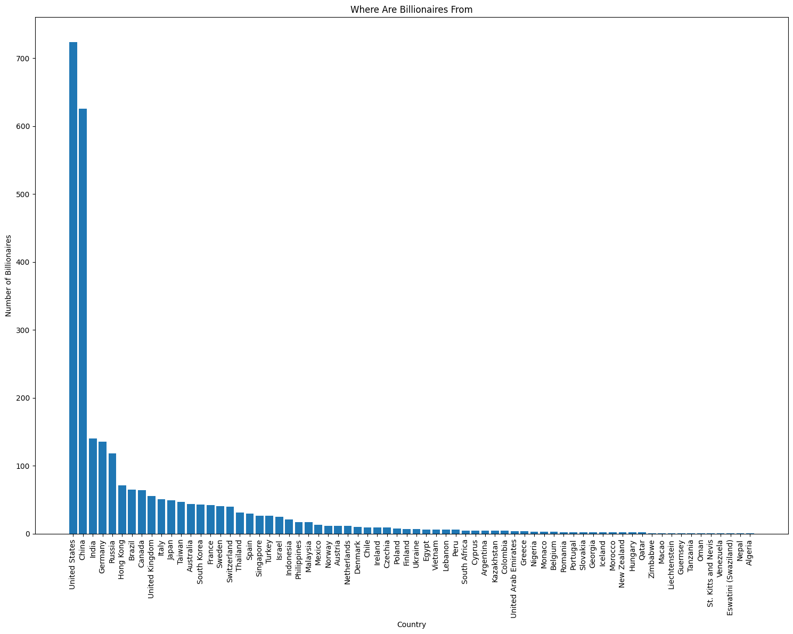

# **Descriptive Analysis Of All The World's Billionaires From 2021**
*(Data Source: Forbes)*

**1. Import the packages necessary for the following analysis.**


```python
import matplotlib.pyplot as plt  # import the package and call it 'plt'
import polars as pl  # import polars and call it 'pl'
```

**2. Read the data using polar and print the data & its statistics**.


```python
pl_df = pl.read_csv("Billionaire_2021.csv", null_values=["N/A"])
pl_df
```


<div><style>
.dataframe > thead > tr,
.dataframe > tbody > tr {
  text-align: right;
  white-space: pre-wrap;
}
</style>
<small>shape: (2_755, 7)</small><table border="1" class="dataframe"><thead><tr><th>Name</th><th>NetWorth</th><th>Country</th><th>Source</th><th>Rank</th><th>Age</th><th>Industry</th></tr><tr><td>str</td><td>str</td><td>str</td><td>str</td><td>i64</td><td>i64</td><td>str</td></tr></thead><tbody><tr><td>&quot;Jeff Bezos&quot;</td><td>&quot;$177 B&quot;</td><td>&quot;United States&quot;</td><td>&quot;Amazon&quot;</td><td>1</td><td>57</td><td>&quot;Technology&quot;</td></tr><tr><td>&quot;Elon Musk&quot;</td><td>&quot;$151 B&quot;</td><td>&quot;United States&quot;</td><td>&quot;Tesla, SpaceX&quot;</td><td>2</td><td>49</td><td>&quot;Automotive&quot;</td></tr><tr><td>&quot;Bernard Arnault &amp; family&quot;</td><td>&quot;$150 B&quot;</td><td>&quot;France&quot;</td><td>&quot;LVMH&quot;</td><td>3</td><td>72</td><td>&quot;Fashion &amp; Retail&quot;</td></tr><tr><td>&quot;Bill Gates&quot;</td><td>&quot;$124 B&quot;</td><td>&quot;United States&quot;</td><td>&quot;Microsoft&quot;</td><td>4</td><td>65</td><td>&quot;Technology&quot;</td></tr><tr><td>&quot;Mark Zuckerberg&quot;</td><td>&quot;$97 B&quot;</td><td>&quot;United States&quot;</td><td>&quot;Facebook&quot;</td><td>5</td><td>36</td><td>&quot;Technology&quot;</td></tr><tr><td>&hellip;</td><td>&hellip;</td><td>&hellip;</td><td>&hellip;</td><td>&hellip;</td><td>&hellip;</td><td>&hellip;</td></tr><tr><td>&quot;Daniel Yong Zhang&quot;</td><td>&quot;$1 B&quot;</td><td>&quot;China&quot;</td><td>&quot;e-commerce&quot;</td><td>2674</td><td>49</td><td>&quot;Technology&quot;</td></tr><tr><td>&quot;Zhang Yuqiang&quot;</td><td>&quot;$1 B&quot;</td><td>&quot;China&quot;</td><td>&quot;Fiberglass&quot;</td><td>2674</td><td>65</td><td>&quot;Manufacturing&quot;</td></tr><tr><td>&quot;Zhao Meiguang&quot;</td><td>&quot;$1 B&quot;</td><td>&quot;China&quot;</td><td>&quot;gold mining&quot;</td><td>2674</td><td>58</td><td>&quot;Metals &amp; Mining&quot;</td></tr><tr><td>&quot;Zhong Naixiong&quot;</td><td>&quot;$1 B&quot;</td><td>&quot;China&quot;</td><td>&quot;conglomerate&quot;</td><td>2674</td><td>58</td><td>&quot;Diversified&quot;</td></tr><tr><td>&quot;Zhou Wei family&quot;</td><td>&quot;$1 B&quot;</td><td>&quot;China&quot;</td><td>&quot;Software&quot;</td><td>2674</td><td>54</td><td>&quot;Technology&quot;</td></tr></tbody></table></div>


```python
pl_df.describe()
```


<div><style>
.dataframe > thead > tr,
.dataframe > tbody > tr {
  text-align: right;
  white-space: pre-wrap;
}
</style>
<small>shape: (9, 8)</small><table border="1" class="dataframe"><thead><tr><th>statistic</th><th>Name</th><th>NetWorth</th><th>Country</th><th>Source</th><th>Rank</th><th>Age</th><th>Industry</th></tr><tr><td>str</td><td>str</td><td>str</td><td>str</td><td>str</td><td>f64</td><td>f64</td><td>str</td></tr></thead><tbody><tr><td>&quot;count&quot;</td><td>&quot;2755&quot;</td><td>&quot;2755&quot;</td><td>&quot;2755&quot;</td><td>&quot;2755&quot;</td><td>2755.0</td><td>2676.0</td><td>&quot;2755&quot;</td></tr><tr><td>&quot;null_count&quot;</td><td>&quot;0&quot;</td><td>&quot;0&quot;</td><td>&quot;0&quot;</td><td>&quot;0&quot;</td><td>0.0</td><td>79.0</td><td>&quot;0&quot;</td></tr><tr><td>&quot;mean&quot;</td><td>null</td><td>null</td><td>null</td><td>null</td><td>1345.663521</td><td>63.113602</td><td>null</td></tr><tr><td>&quot;std&quot;</td><td>null</td><td>null</td><td>null</td><td>null</td><td>772.669811</td><td>13.445153</td><td>null</td></tr><tr><td>&quot;min&quot;</td><td>&quot;A. Jayson Adair&quot;</td><td>&quot;$1 B&quot;</td><td>&quot;Algeria&quot;</td><td>&quot;3D printing&quot;</td><td>1.0</td><td>18.0</td><td>&quot;Automotive&quot;</td></tr><tr><td>&quot;25%&quot;</td><td>null</td><td>null</td><td>null</td><td>null</td><td>680.0</td><td>54.0</td><td>null</td></tr><tr><td>&quot;50%&quot;</td><td>null</td><td>null</td><td>null</td><td>null</td><td>1362.0</td><td>63.0</td><td>null</td></tr><tr><td>&quot;75%&quot;</td><td>null</td><td>null</td><td>null</td><td>null</td><td>2035.0</td><td>73.0</td><td>null</td></tr><tr><td>&quot;max&quot;</td><td>&quot;Zygmunt Solorz-Zak&quot;</td><td>&quot;$97 B&quot;</td><td>&quot;Zimbabwe&quot;</td><td>&quot;★&quot;</td><td>2674.0</td><td>99.0</td><td>&quot;Telecom&quot;</td></tr></tbody></table></div>


**3. Determine how many billionaires there are from each country in this dataset.**


```python
country_count = pl_df.select(pl.col("Country").value_counts())
country_count
```


<div><style>
.dataframe > thead > tr,
.dataframe > tbody > tr {
  text-align: right;
  white-space: pre-wrap;
}
</style>
<small>shape: (70, 1)</small><table border="1" class="dataframe"><thead><tr><th>Country</th></tr><tr><td>struct[2]</td></tr></thead><tbody><tr><td>{&quot;Mexico&quot;,13}</td></tr><tr><td>{&quot;Romania&quot;,2}</td></tr><tr><td>{&quot;Japan&quot;,49}</td></tr><tr><td>{&quot;South Africa&quot;,5}</td></tr><tr><td>{&quot;Egypt&quot;,6}</td></tr><tr><td>&hellip;</td></tr><tr><td>{&quot;Qatar&quot;,2}</td></tr><tr><td>{&quot;China&quot;,626}</td></tr><tr><td>{&quot;Czechia&quot;,9}</td></tr><tr><td>{&quot;Colombia&quot;,5}</td></tr><tr><td>{&quot;Germany&quot;,136}</td></tr></tbody></table></div>


```python
print(country_count.columns)
print(country_count.dtypes)
```

    ['Country']
    [Struct({'Country': String, 'count': UInt32})]


```python
# get 'count' value
count_values = country_count.select(
    pl.col("Country").struct.field("count").alias("count")
)

# get the statistics for the distribution of billionaires
stats = count_values.select(
    [
        pl.col("count").mean().alias("Mean"),
        pl.col("count").median().alias("Median"),
        pl.col("count").std().alias("Standard_Deviation"),
    ]
)

stats
```


<div><style>
.dataframe > thead > tr,
.dataframe > tbody > tr {
  text-align: right;
  white-space: pre-wrap;
}
</style>
<small>shape: (1, 3)</small><table border="1" class="dataframe"><thead><tr><th>Mean</th><th>Median</th><th>Standard_Deviation</th></tr><tr><td>f64</td><td>f64</td><td>f64</td></tr></thead><tbody><tr><td>39.357143</td><td>7.0</td><td>114.120841</td></tr></tbody></table></div>


**6. Make a barplot that shows the counts of how many billionaires there are from each country.**


```python
# get value from country_count DataFrame since its a pl dataframe
countries = country_count.select(pl.col("Country").struct.field("Country")).to_series()
counts = country_count.select(pl.col("Country").struct.field("count")).to_series()
# sort the value
sorted_data = sorted(zip(countries, counts), key=lambda x: x[1], reverse=True)
countries, counts = zip(*sorted_data)

# plot
plt.figure(figsize=(15, 12))
plt.bar(countries, counts)
plt.title("Where Are Billionaires From")
plt.xlabel("Country")
plt.ylabel("Number of Billionaires")
plt.xticks(rotation=90)
plt.tight_layout()
plt.show()
```


    

    


**5. Summary**  
In 2021, <u>nearly **half of the world's billionaires** hailed from just two countries: **the United States and China**</u>. The U.S. led with **724** billionaires, closely followed by China with **626**. There was a significant gap between these top two nations and the third-placed India, which had **140** billionaires. The large standard deviation in billionaire counts across countries indicates a <u>**substantial disparity in the distribution of ultra-high net worth individuals globally**</u>. The bar plot of billionaire populations by country exhibits a pronounced <u>**right-skewed distribution**</u>, which is consistent with the relatively low median of 7 billionaires per country. This skewness reflects the concentration of extreme wealth in a small number of nations, while most countries have comparatively few billionaires.

